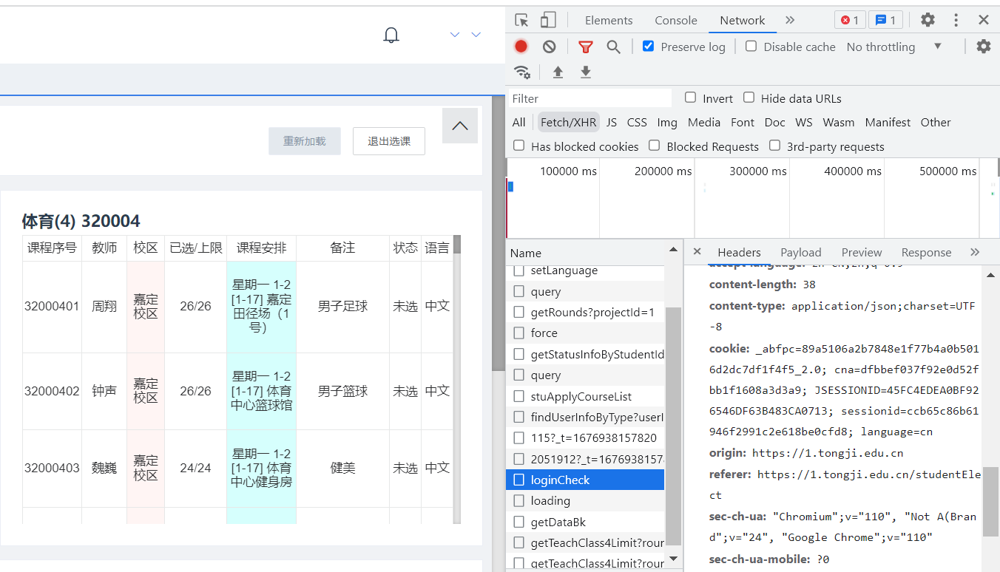

## 简介
本程序是同济大学抢课程序，准确来说是捡漏，目前在第四轮抢体育课（捡漏）使用成功，使用时间为2023-2-20；主要使用爬虫相关的技术，可以定义为半自动脚本

## 注意事项
1. 本代码只适用于同一课程名称的多个课程序号捡漏（比如体育(4)下有众多种类，可根据喜好选择足球，羽毛球等多个，但暂不支持同时对体育(4)和玉石两个课程名称捡漏），若需扩展程序功能实现多课程名称捡漏需要修改接口信息（也可以考虑将该类多线程）
2. 避免与已有课程冲突，否则会出现意外错误（程序没有考虑该错误处理）
3. 当选上某一课时程序结束。比如体育(4)同时选择A老师的足球和B老师的羽毛球，在选上A老师足球课后程序结束
4. 第三轮选课不一定适用（未测试）
5. 选课需要先进入选课网页，获取必要信息（所以是半自动脚本）。但如果每学期课程没有变化，可以尝试在下次抢课
6. 选体育(4)不需要修改接口，其他课程需要修改接口
7. 在python3.8已成功使用

## 使用方式
1. 参数填写
student_id，cookies中的sessionid，`target_teachClassCode`，分别代表学号，sessionid和欲选课程的代号（对应选课界面中的课程序号）,需要自行修改。sessionid获取：打开浏览器开发者模式，调至`network`，进入选课界面，找到`name`为`loginCheck`的接口（可以用Fetch/XHR筛选），在`Headers`中下拉找到`cookie`一行，含有sessionid，复制下来即可，如图
如果是选择体育(4)不需要修改接口信息，选择其他课程需要修改`getTeachClass4Limit`变量，具体接口获取与sessionid获取类似，开发者模式下打开对应的课程名称，在开发者面板的`network`中找到新出现的接口，点开找到`RequestURL`一栏，这就是接口信息
2. 开始运行
程序路径下执行`python selectCourse`即可（该指令为参考，根据环境变量的不同可能会有不同python），只要能运行起selectCourse即可
3. 输出信息
每一轮遍历`target_teachClassCode`逐一提交课程申请，每一轮会有提示当前轮数，每次提交会给出提交课程的信息及结果，当选中课程后，给出提示，结束程序。

## 如果觉得还行可以star
